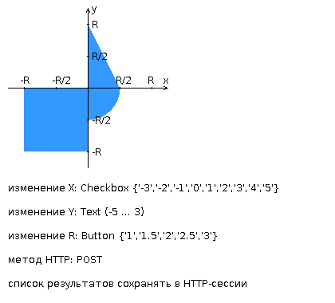

# Лабораторная работа #2 Вариант: 1265

Разработать веб-приложение на базе сервлетов и JSP, определяющее попадание точки на координатной плоскости в заданную
область.

## Приложение должно быть реализовано в соответствии с шаблоном MVC и состоять из следующих элементов:

`ControllerServlet`, определяющий тип запроса, и, в зависимости от того, содержит ли запрос информацию о координатах
точки и радиусе, делегирующий его обработку одному из перечисленных ниже компонентов. Все запросы внутри приложения
должны передаваться этому сервлету (по методу GET или POST в зависимости от варианта задания), остальные сервлеты с
веб-страниц напрямую вызываться не должны.
- > Возможный способ ограничения доступа (на защите не спрашивали): 
  > https://stackoverflow.com/questions/40133177/how-to-determine-request-is-forwarded-or-not-in-java-filters 

`AreaCheckServlet`, осуществляющий проверку попадания точки в область на координатной плоскости и формирующий
HTML-страницу с результатами проверки. Должен обрабатывать все запросы, содержащие сведения о координатах точки и
радиусе области.

Страница `JSP`, формирующая HTML-страницу с веб-формой. Должна обрабатывать все запросы, не содержащие сведений о
координатах точки и радиусе области.

## Разработанная страница JSP должна содержать:

1. "Шапку", содержащую ФИО студента, номер группы и номер варианта.
2. Форму, отправляющую данные на сервер.
3. Набор полей для задания координат точки и радиуса области в соответствии с вариантом задания.
4. Сценарий на языке JavaScript, осуществляющий валидацию значений, вводимых пользователем в поля формы.
5. Интерактивный элемент, содержащий изображение области на координатной плоскости (в соответствии с вариантом задания)
   и реализующий следующую функциональность:
    - Если радиус области установлен, клик курсором мыши по изображению должен обрабатываться JavaScript-функцией,
      определяющей координаты точки, по которой кликнул пользователь и отправляющей полученные координаты на сервер для
      проверки факта попадания.
    - В противном случае, после клика по картинке должно выводиться сообщение о невозможности определения координат
      точки.
    - После проверки факта попадания точки в область изображение должно быть обновлено с учётом результатов этой
      проверки (т.е., на нём должна появиться новая точка).
6. Таблицу с результатами предыдущих проверок. Список результатов должен браться из контекста приложения, HTTP-сессии
   или Bean-компонента в зависимости от варианта.

## Страница, возвращаемая AreaCheckServlet, должна содержать:

1. Таблицу, содержащую полученные параметры.
2. Результат вычислений - факт попадания или непопадания точки в область.
3. Ссылку на страницу с веб-формой для формирования нового запроса.

Разработанное веб-приложение необходимо развернуть на сервере **WildFly**[^1]. Сервер должен быть запущен в
standalone-конфигурации, порты должны быть настроены в соответствии с выданным portbase, доступ к http listener'у должен
быть открыт для всех IP.

[^1]: Есть видео от Эридана, как деплоить + есть запись семенара с Цопой по деплою.

## Вопросы к защите лабораторной работы:
- [x] Java-сервлеты. Особенности реализации, ключевые методы, преимущества и недостатки относительно CGI и FastCGI.
- [x] Контейнеры сервлетов. Жизненный цикл сервлета.
- [x] Диспетчеризация запросов в сервлетах. Фильтры сервлетов.
- [x] HTTP-сессии - назначение, взаимодействие сервлетов с сессией, способы передачи идентификатора сессии.
- [x] Контекст сервлета - назначение, способы взаимодействия сервлетов с контекстом.
- [x] JavaServer Pages. Особенности, преимущества и недостатки по сравнению с сервлетами, область применения.
- [x] Жизненный цикл JSP.
- [x] Структура JSP-страницы. Комментарии, директивы, объявления, скриптлеты и выражения.
- [x] Правила записи Java-кода внутри JSP. Стандартные переменные, доступные в скриптлетах и выражениях.
- [x] Bean-компоненты и их использование в JSP.
- [x] Стандартные теги JSP. Использование Expression Language (EL) в JSP.
  - презентация [с 207]
  - > `foreach`, `if`, `redirect` ...
- [x] [Параметры конфигурации JSP](https://studfile.net/preview/1029763/page:9/) в дескрипторе развёртывания веб-приложения.
  - > дескриптор развертывания - `WEB-INF/web.xml`
- [x] Шаблоны проектирования и архитектурные шаблоны. Использование в веб-приложениях.
- [x] Архитектура веб-приложений. Шаблон MVC. Архитектурные модели Model 1 и Model 2 и их реализация на платформе Java EE.
- > Полезный материал "Вопросы по Java на собеседовании": https://java-online.ru/java-interview-08.xhtml

## Доп. задание

> - [x] Написать фильтр.
>   - [x] Хранить в контексте время последнего изменения коллекции точек.
>   - [x] При получении гет-запросов на получение всех точек, нужно проверить в запросе заголовок `If-Modified-Since`. 
>     - Если он присутствует и в нем указан момент времени позднее чем момент последнего обновления коллекции, то ответить **304 Not Modified**. 
>     - Во всех остальных случаях пропустить запрос на сервлет.
>     - Формат момента времени используемые в заголовке можно погуглить.

В доп. задании прикол: нужно, но **не сказало** хранить еще и в браузере время последенего изменения (в куки), и в
заголовке отправлять его, а не текущее время отправлять. Для тестирования можно использовать `curl`:
создание изменения:
```bash
curl "localhost:8080/lab-2-1.0-SNAPSHOT/AreaCheckServlet?x=1&y=1&r=1" \
      -I #only headers
```
отправка запроса с указанием даты последнего изменения:
```bash
curl "localhost:8080/lab-2-1.0-SNAPSHOT/" -I \
      -H "If-Modified-Since: Thu, 03 Nov 2022 19:03:42 GMT" 
```

