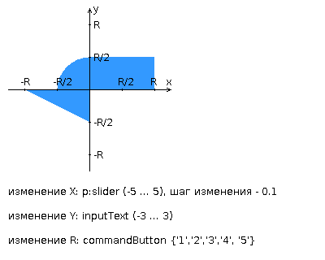

# Лабораторная работа #3 Вариант: 13155

Внимание! У разных вариантов разный текст задания!
Разработать приложение на базе **JavaServer Faces Framework**, которое осуществляет проверку попадания точки в заданную
область на координатной плоскости.

Приложение должно включать в себя **2 facelets-шаблона** - стартовую страницу и основную страницу приложения, а также набор
управляемых бинов (managed beans), реализующих логику на стороне сервера.

## Стартовая страница должна содержать следующие элементы:

- [x] "Шапку", содержащую ФИО студента, номер группы и номер варианта.
- [x] Интерактивные часы, показывающие текущие дату и время, *обновляющиеся раз в **8** секунд*.
  - > Взять код бина и xml-компонент можно на офф [сайте primefaces](http://www.primefaces.org:8080/showcase/ui/misc/clock.xhtml?jfwid=e9487).
    > 
    > Так же начните с того, что запустите [пример кода для primefaces c github](https://github.com/primefaces/primefaces), потом простые часы на клиенте `<h:clock />`
- [x] Ссылку, позволяющую перейти на основную страницу приложения.
  - > Настроить навигацию в `faces-config.xml` и добавить на страницы кнопки с атрибутом `<h:button outcome="main">...</h:button>`

## Основная страница приложения должна содержать следующие элементы:

- [x] Набор компонентов для задания координат точки и радиуса области в соответствии с вариантом задания. Может
  потребоваться использование дополнительных библиотек компонентов - **ICEfaces** (префикс "`ace`") и **PrimeFaces** (
  префикс "`p`"). Если компонент допускает ввод заведомо некорректных данных (таких, например, как буквы в координатах
  точки или отрицательный радиус), то приложение должно осуществлять их валидацию.
- [x] Динамически обновляемую картинку, изображающую область на координатной плоскости в соответствии с номером варианта
  и точки, координаты которых были заданы пользователем. Клик по картинке должен инициировать сценарий, осуществляющий
  определение координат новой точки и отправку их на сервер для проверки её попадания в область. Цвет точек должен
  зависить от факта попадания / непопадания в область. Смена радиуса также должна инициировать перерисовку картинки.
- [x] Таблицу со списком результатов предыдущих проверок.
- [x] Ссылку, позволяющую вернуться на стартовую страницу.

> Минимально рабочий вариант лабы в коммите [e9272c2](https://github.com/e1turin/itmo-webdev/tree/e9272c25507fecbc27451a2be349a176d7012568)
> 
> Дальше добавлены стили из Bootstrap
> 
> Можно еще попробовать [Material Theme](https://github.com/material-components/material-components-web)
>    - #Demos: https://material-components.github.io/material-components-web-catalog/#/

## Дополнительные требования к приложению:

- [x] Все результаты проверки должны сохраняться в базе данных под управлением СУБД **PostgreSQL**.
  - > Чтобы запустить мою лабу, нужно создать базу данных со схемой подобно `src/main/resources/database/scheme.sql` 
    (удобно в докере, см. статью на хабре) и указать переменные среды (`System.getenv`), использующиеся
    в `model/database/DbManager.java`
- [x] Для доступа к БД необходимо использовать протокол **JDBC** **без каких-либо дополнительных** библиотек.
- [x] Для управления списком результатов должен использоваться **Session-scoped Managed Bean**.
  - > Вместе с тем хорошо использовать DI, именно то что подразумевают бины. Так что я добавил `@Inject` для полей в
    бинах, потому как там довольно _тяжелые_ объекты, которые по-хорошему должны быть одни на все приложение. Однако не
    получилось заинжектить котлин-бин, похоже Jakarta не дружит с Kotlin
  - > Для понимания зачем нужен DI, IoC и как оно работает, советую
    посмотреть [видео потрошителя Spring'а](https://youtu.be/rd6wxPzXQvo)
  - > В идеале нужно вводить абстракции (интерфейсы и пр.), но т.к. лаба не впрод, а в ящик, то это было бы преждевременной оптимизацией :D.
- [x] Конфигурация **управляемых** бинов должна быть задана с помощью *аннотаций*.
  - > Не стану делать Singleton'ами бины, которые ApplicationScoped по [одной причине](https://stackoverflow.com/a/33973197/19036461).
- [x] Правила навигации между страницами приложения должны быть заданы в отдельном конфигурационном файле.

## Вопросы к защите лабораторной работы:
> cheatsheet: https://github.com/band-of-four/cheatsheets/blob/master/Internet-Applications-Development/Lab3.md

- [x] Технология `JavaServer Faces`. Особенности, отличия от сервлетов и `JSP`, преимущества и недостатки. Структура
  JSF-приложения.
  - > JSP - динамические страницы, а JSF - MVC модель, где FacesServlet - Controller, xhtml - view, beans и другие
    использующиеся в них классы - model.
- [x] Использование JSP-страниц и Facelets-шаблонов в JSF-приложениях.
- [x] JSF-компоненты - особенности реализации, иерархия классов. Дополнительные библиотеки компонентов. Модель обработки
  событий в JSF-приложениях.
- [x] Конвертеры и валидаторы данных.
- [x] Представление страницы JSF на стороне сервера. Класс `UIViewRoot`.
- [x] Управляемые бины - назначение, способы конфигурации. Контекст управляемых бинов.
  - https://balusc.omnifaces.org/2011/09/communication-in-jsf-20.html
- [x] Конфигурация JSF-приложений. Файл `faces-config.xml`. Класс `FacesServlet`.
- [x] Навигация в JSF-приложениях.
- [x] Доступ к БД из Java-приложений. Протокол JDBC, формирование запросов, работа с драйверами СУБД.
- [x] Концепция ORM. Библиотеки ORM в приложениях на Java. Основные API. Интеграция ORM-провайдеров с драйверами JDBC.
- [x] Библиотеки ORM Hibernate и EclipseLink. Особенности, API, сходства и отличия.
- [x] Технология JPA. Особенности, API, интеграция с ORM-провайдерами.
  - > Из чего состоит JPA? [(wiki)](https://en.wikipedia.org/wiki/Jakarta_Persistence)
    >    - API (jakarta.persistence).
    >    - Query Language.
    >    - Object/relational metadata.

